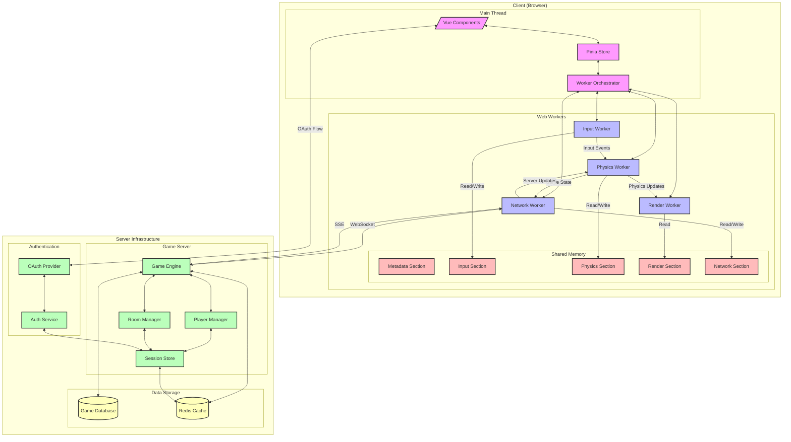

# Multiplayer Pong

A modern implementation of the classic [Pong] game, built with real-time multiplayer capabilities using cutting-edge web technologies.

## Overview

This project reimagines the classic [Pong] game with modern web technologies, offering a seamless multiplayer experience. It leverages `Web Worker`s for performance, `SharedArrayBuffer` for efficient state management, and a binary `WebSocket` protocol for real-time gameplay.

### Key Features

- 🎮 Real-time multiplayer gameplay
- 🎯 Precise physics engine with collision detection
- 🔒 Secure room-based matchmaking
- 🔄 State-of-the-art synchronization
- 📊 Game replay system
- 🔐 `OAuth` authentication
- 📱 Responsive design

## Technology Stack

<!-- ### Frontend
- **Framework**: [Nuxt.js 3.x](https://nuxt.com/)
- **State Management**: [Pinia](https://pinia.vuejs.org/)
- **Type Safety**: [TypeScript](https://www.typescriptlang.org/) -->

### Real-time Features
- `Web Worker`s for multi-threading
- `SharedArrayBuffer` for efficient state sharing
- `OffscreenCanvas` for optimized rendering
- Binary `WebSocket` protocol
- `Server-Sent Event`s (`SSE`) for state updates

### Performance Features
- **Multi-threaded** architecture
- **Binary-only** data transfer
- *Delta compression* for state updates
- Predictive input handling
- State interpolation

## Architecture Overview

The application uses a multi-worker architecture for optimal performance:



## Getting Started

### Prerequisites
- Node.js 22.x or higher
- pnpm 9.x or higher
- Modern browser with `SharedArrayBuffer` support

<!-- ### Development Setup

1. Clone the repository:
```bash
git clone https://github.com/nandordudas/multiplayer-pong.git
cd multiplayer-pong
```

2. Install dependencies:
```bash
pnpm install
```

3. Start the development server:
```bash
pnpm dev
```

4. Open [https://localhost:3000](https://localhost:3000) in your browser

### Build for Production

```bash
pnpm build
``` -->

<!-- ### Commit Convention

We follow the [Conventional Commits](https://www.conventionalcommits.org/) specification:

- `feat:` New features
- `fix:` Bug fixes
- `docs:` Documentation changes
- `style:` Code style changes (formatting, semicolons, etc.)
- `refactor:` Code refactoring
- `perf:` Performance improvements
- `test:` Adding or modifying tests
- `build:` Build system or external dependency changes
- `ci:` CI configuration changes
- `chore:` Other changes that don't modify src or test files -->

## Performance Goals

- Frame time: < `16ms`
- Network latency: < `50ms`
- Bandwidth usage: < `100KB/s`
- Input lag: < `100ms`
- State update rate: `60Hz`

## Browser Support

- Chrome/Edge 89+
- Firefox 89+
- Safari 15.2+

*Note: Browsers must support `SharedArrayBuffer` and `cross-origin isolation`.*

## Security Considerations

This project requires specific security headers for `SharedArrayBuffer`:

```http
Cross-Origin-Embedder-Policy: require-corp
Cross-Origin-Opener-Policy: same-origin
```

## License

This project is licensed under the `MIT License` - see the [LICENSE](LICENSE) file for details.

## Acknowledgments

- Original [Pong] game by Atari
- [Nuxt.js](https://nuxt.com/) team
- [Vue.js](https://vuejs.org/) team

## Project Status

🚧 **Currently in Development** 🚧

<!-- Check our [project board](https://github.com/nandordudas/multiplayer-pong/projects/1) for current progress and planned features. -->

[Pong]: https://en.wikipedia.org/wiki/Pong
